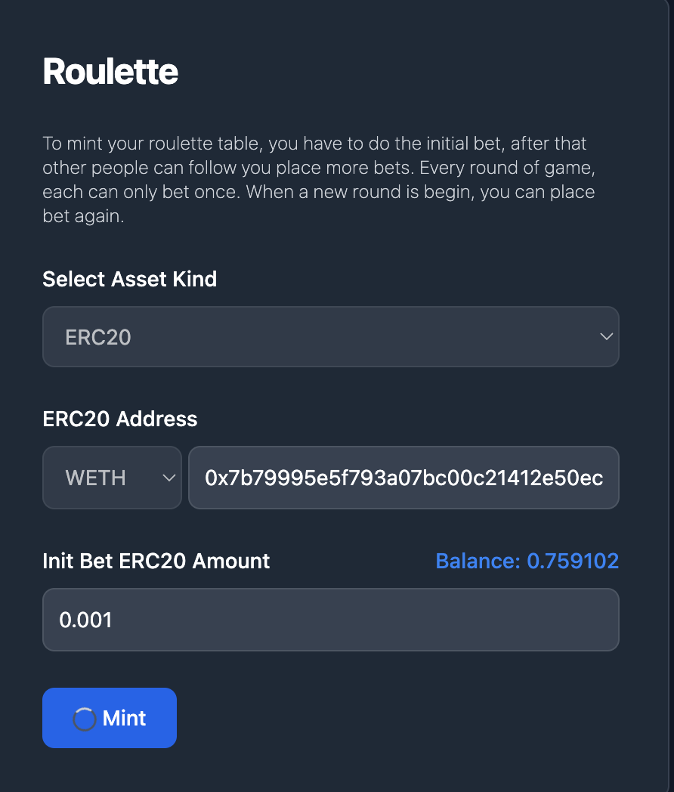

# Roulette

Roulette NFT is like the casino game where players place bet into the roulette and the dealer spin the roulette and to see who wins all.

### Mint

Head to: [https://deswap.one/app/roulette](https://deswap.one/app/roulette)

The Roulette NFT support deposit ERC20/721/1155 tokens, in this tutorial I will show you how to mint a Roulette with ERC20 tokens.

<figure><figcaption></figcaption></figure>

This means that this roulette accepts bets in WETH

After that we go to the detail page

<figure><figcaption></figcaption></figure>

The roulette NFT is a ERC721 token, no need to sell at opensea, just copy the link and send to other people to let them make bets.

### Place bets

I will switch to another address to place bets.

Remember the link: [https://deswap.one/app/sepolia/0xaC0f2E348A8501349c366cEfe49658918CaccA01/1](https://deswap.one/app/sepolia/0xaC0f2E348A8501349c366cEfe49658918CaccA01/1)

Every address can only bet once in the same round.

<figure><figcaption></figcaption></figure>

I will bet 0.02 WETH, now betted users are 2

<figure><figcaption></figcaption></figure>

Because I'm not the token owner, so I can't open the roulette. Let's switch back to the minter's address and click the open button.

Take a look at etherscan: [https://sepolia.etherscan.io/tx/0x04fd0f3c52955c786ced74ca376e423541d64667f9e0bf849ad6344e0c7f31b1](https://sepolia.etherscan.io/tx/0x04fd0f3c52955c786ced74ca376e423541d64667f9e0bf849ad6344e0c7f31b1)

<figure><figcaption></figcaption></figure>

3 ERC20 transfer happened.

The total bets are (0.001+0.02) = 0.021

platform fee is 5%, so `0x720a` got `0.021*0.05=0.00105`

owner fee is 5%, so `0x7e72` got `0.021*0.005=0.00105`

winner get the rest 90%, that is `0.0189`

ERC721 and ERC1155 are the same process, you can try it yourself.
